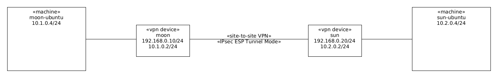

This is a [Vagrant](https://www.vagrantup.com/) Environment for a IPsec VPN device based on [strongSwan](https://strongswan.org).

IPsec Encapsulating Security Payload (ESP) tunnel mode is used between each VPN device.

These are the machines and how they are connected with each other:




# Usage

Build and install the [Ubuntu Base Box](https://github.com/rgl/ubuntu-vagrant).

Launch the environment:

```bash
vagrant up --no-destroy-on-error
```

Login into the `moon` machine (a VPN device), and watch the network traffic,
IPsec Encapsulating Security Payload (ESP) or TCP port 3000:

```bash
vagrant ssh moon # moon (10.1.0.2)
sudo -i
tcpdump -n -i any esp or tcp port 3000
```

Then, ssh into the `moon-ubuntu` machine (`10.1.0.4`), and try accessing the
`sun-ubuntu` machine (`10.2.0.4`):

```bash
vagrant ssh moon-ubuntu # moon-ubuntu (10.1.0.4)
wget -qO- 10.2.0.4:3000 # sun-ubuntu  (10.2.0.4)
```

Go back to the `moon` machine shell and stop the VPN device service:

```bash
systemctl stop strongswan-swanctl
tcpdump -n -i any esp or tcp port 3000
```

Go back to the `moon-ubuntu` machine shell, and try accessing the `sun-ubuntu`
machine (`10.2.0.4`), this time, it will not work (because the `moon` VPN
device service is stopped):

```bash
wget -qO- 10.2.0.4:3000 # sun-ubuntu (10.2.0.4)
```

To make things work again, go back to the `moon` machine shell, and start the
VPN device:

```bash
systemctl start strongswan-swanctl
tcpdump -n -i any esp or tcp port 3000
```

Go back to the `moon-ubuntu` machine shell, and try accessing the `sun-ubuntu`
machine (`10.2.0.4`), this time, it will work again (because the `moon` VPN
device is started):

```bash
wget -qO- 10.2.0.4:3000 # sun-ubuntu (10.2.0.4)
```

# Reference

* https://wiki.strongswan.org/projects/strongswan/wiki/IntroductionTostrongSwan
